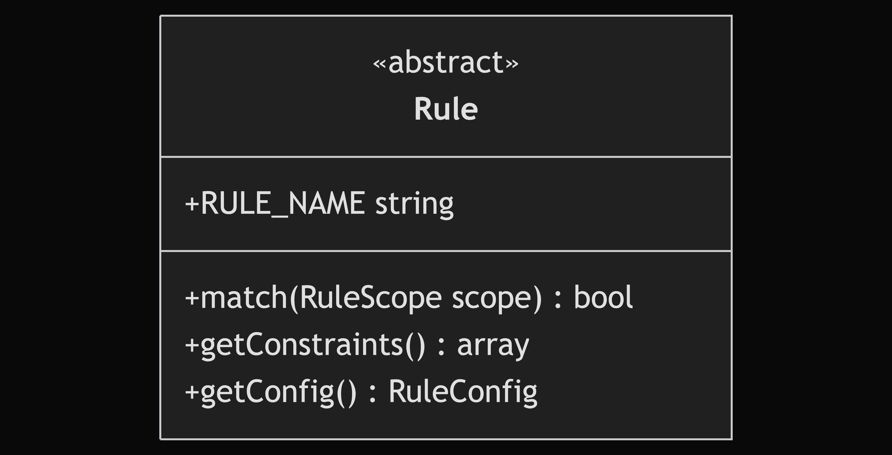
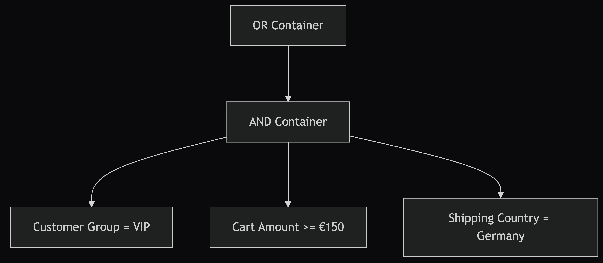
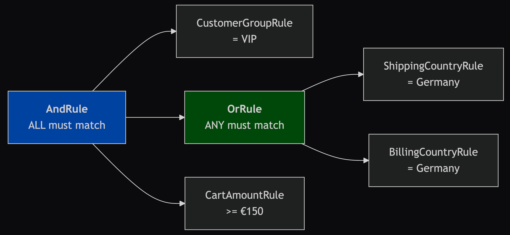
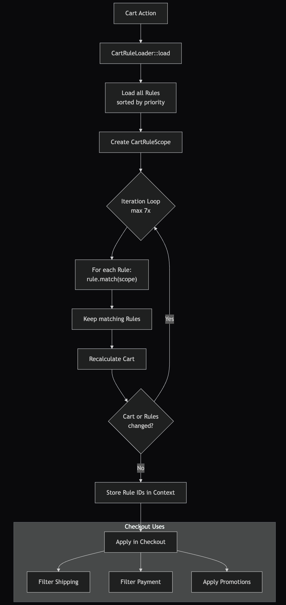
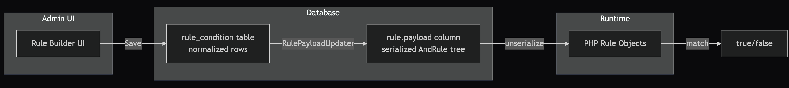
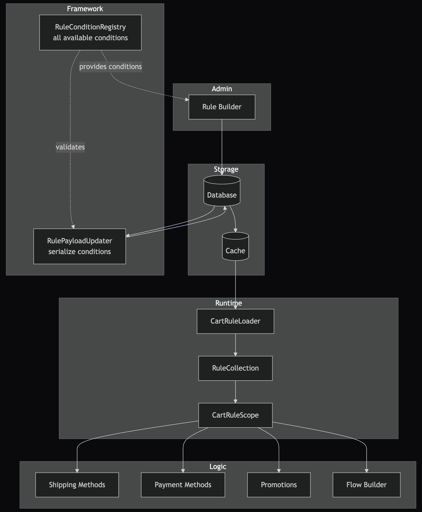

<!-- _class: lead -->

# Rule Builder

fundamentals@after-sales

---

## What is the Rule Builder?

The Rule Builder allows merchants to create _dynamic business rules_ without code to control:

- Shipping method availability
- Payment method availability
- Promotions & Discounts
- Product pricing
- Flow Builder conditions

---

## Rule system vs. Rule Builder

- The **rule system** is the generic engine: evaluate composable rules against a _scope_ (cart, order, customer, …).
- The **Rule Builder** is the Administration UI: configure rule conditions and combine them visually into a rule tree.

---

<!-- _class: lead -->

## Definition

"Compare an _input_ value from the _scope_ with a configured _value_ using an _operator_."

---

<!-- _class: lead -->

## Rule

Every rule implements a simple interface:

Core question: Does this condition match the current context?

---

## Rule contract (important properties)

- **Input**: rules do _not_ fetch data. Everything comes from the provided _rule scope_.
- **Output**: always a **boolean** (`true` / `false`).
- **No side effects**: rules don't change carts, orders, or state. They're pure evaluations.

---

<!-- _class: lead -->

## Example

"If the _customer's group_ is _'VIP'_ **AND** the _cart amount_ is greater than or equal to _€150_ **AND** the _shipping country_ is _Germany_, then offer the _'Express Shipping'_ method."

---

<!-- _class: lead -->

## Example tree

---

<!-- _class: lead -->

## Composite Pattern (Container Rules)

Rules are composed as a _tree structure_ using logical containers:

---

## Container Types

| Container             | Logic          |
| --------------------- | -------------- |
| AndRule               | ALL            |
| OrRule                | ANY            |
| NotRule               | NEGATE         |
| XorRule               | EXACTLY ONE    |
| MatchAllLineItemsRule | ALL LINE ITEMS |

---

<!-- _class: lead -->

## Evaluation Context (Rule scope)

Scopes provide the _context data_ for rule evaluation:

---

## Runtime usage patterns

- **ID-based decisions**: entities reference an `availability_rule_id` and are allowed if the ID is in `SalesChannelContext::getRuleIds()`.
- **Direct evaluation**: fetch a rule tree, build the right scope, and call `Rule::match(scope)` on the root.

---

<!-- _class: lead -->

## Rule Evaluation

---

<!-- _class: lead -->

## Payload Storage

Rules are stored as _serialized PHP objects_ for fast runtime evaluation.

---

<!-- _class: lead -->

## Architecture Summary

---

<!-- _class: lead -->

## Bottleneck

Rule evaluation needs the cart.
Cart calculation needs the rules.

That creates a costly dependency cycle (lots of loading on each request).

=> Rule System v2 [RFC](https://github.com/shopware/shopware/discussions/3406)

---

<!-- _class: lead -->

## Questions?
